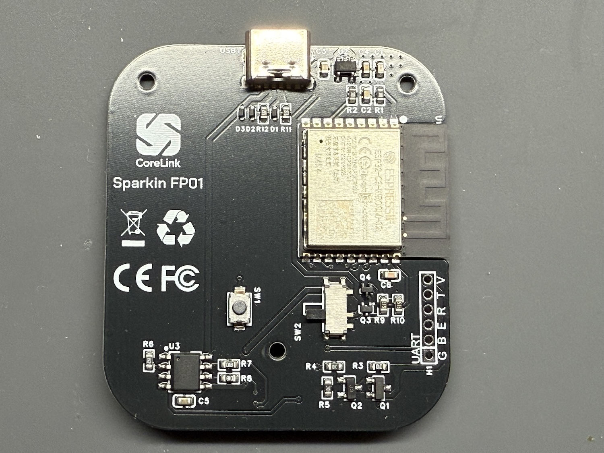
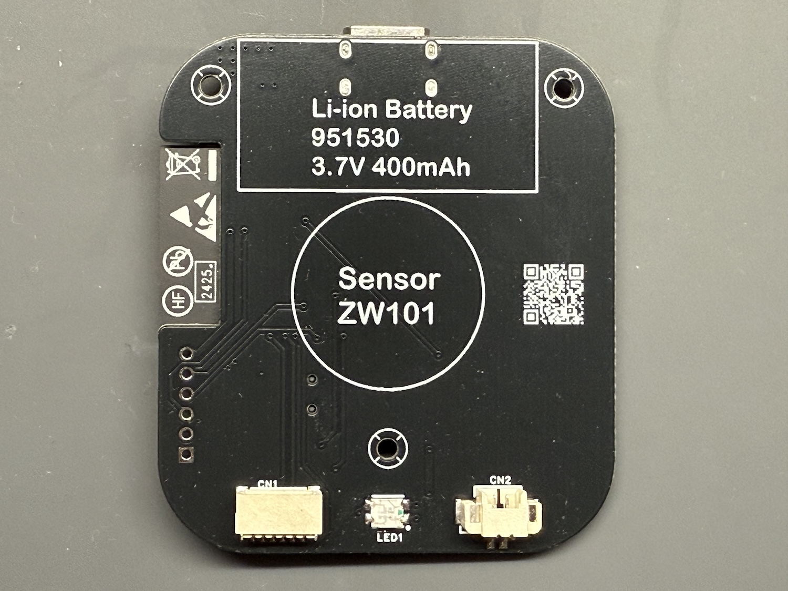
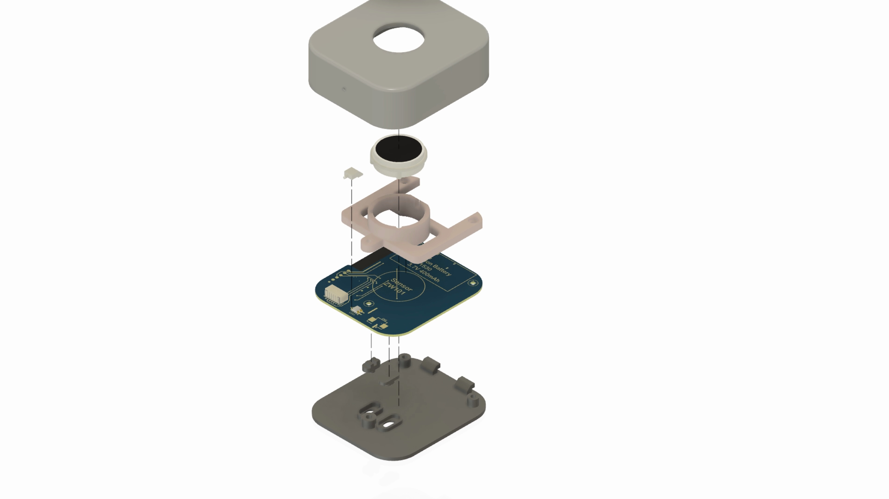

# MYNOVA-Sparkin

[中文文档](README_CHS.md) | [English](README.md)

## Overview

MYNOVA-Sparkin is a wireless Bluetooth fingerprint recognition device for Windows computers. It provides fast fingerprint identification (0.5 seconds), local fingerprint management, and system login integration. The project includes complete hardware design, firmware, and Windows supporting software.






## Key Features

- **Fast Recognition**: 0.5-second fingerprint identification
- **Wireless Connectivity**: Bluetooth BLE 5.0 for stable connections
- **System Integration**: Automatic Windows login when fingerprint is verified
- **Local Storage**: Fingerprints stored securely on the device
- **Portable Design**: Built-in battery with Type-C charging
- **Power Efficient**: Automatic sleep mode to conserve battery
- **OTA Updates**: Over-the-air firmware update support

## Getting Started

### Prerequisites

- Windows 10/11 computer with Bluetooth support
- Type-C charging cable (for initial device charging)

### Installation

1. Download the latest Windows installer from the [Releases](https://github.com/tomosawa/MYNOVA-Sparkin/releases) page
2. Run the installer and follow the on-screen instructions
3. After installation, the Sparkin service will start automatically
4. Launch the Sparkin configuration client from the Start menu

### Device Pairing

1. Press and hold the pairing button for 3 seconds until the LED blinks
2. Open the Sparkin configuration client
3. Click "Add Device" and select "Sparkin FP01"
4. Follow the instructions to complete pairing

### Fingerprint Enrollment

1. Ensure the device is connected
2. Go to "Fingerprint Management" in the client
3. Click "Enroll New Fingerprint"
4. Scan your fingerprint multiple times as instructed
5. Assign a name to the fingerprint

### System Login Setup

1. Go to "Login Settings" in the client
2. Enable "Automatic Login with Fingerprint"
3. Enter your Windows login password
4. Click "Save" to complete setup

## Project Structure

```
MYNOVA-Sparkin/
├── SparkinFW/          # Device firmware (Arduino/ESP32-C3)
├── SparkinWin/         # Windows application and setup
├── 3DModels/           # Enclosure 3D models
├── Labels/             # Label design files
└── PCB/                # PCB design files
```

### SparkinFW
Device firmware built on Arduino framework for ESP32-C3, featuring:
- Fingerprint sensor management
- Bluetooth BLE communication
- Power and battery management
- Sleep mode control
- OTA update support

### SparkinWin
Windows supporting applications:
- Background service for Bluetooth communication
- Configuration client for device management
- Fingerprint enrollment interface
- System login integration

## Development

### Firmware Development

- **IDE**: Arduino IDE 2.3.6+
- **ESP32 Core**: 3.1.1+
- **Language**: C++

### Windows Application Development

- **IDE**: Visual Studio 2022
- **Framework**: Windows SDK for Windows 10/11
- **Language**: C#/C++

## Documentation

For detailed technical documentation:
- [Firmware Architecture](docs/firmware-architecture.md)
- [Windows Application Guide](docs/windows-application.md)

## Contributing

Contributions are welcome! Please follow these steps:

1. Fork the repository
2. Create a feature branch
3. Make your changes
4. Submit a pull request

## Copyright Statement

This project is prohibited for any commercial use and is intended for learning and DIY purposes only.

## License [LICENSE](LICENSE)

This project is licensed under the [GPLv3](LICENSE). [GPLv3 (GNU General Public License version 3)](LICENSE) is a free, open-source software license that guarantees users the freedoms to run, study, share, and modify the software.
The complete text of the [GPLv3](LICENSE) license is included in the [LICENSE](LICENSE) file of this project. Before using, modifying, or distributing the code of this project, make sure you have read and understood the entire [GPLv3](LICENSE) license.

## Acknowledgments

- [Espressif Systems](https://www.espressif.com/) for ESP32-C3
- [Arduino Framework](https://www.arduino.cc/) community
- [Bluetooth SIG](https://www.bluetooth.com/) for BLE standards
- [Microsoft Learn](https://learn.microsoft.com/en-us/windows/win32/secauthn/credential-providers-in-windows) for Windows credential provider documentation
---


